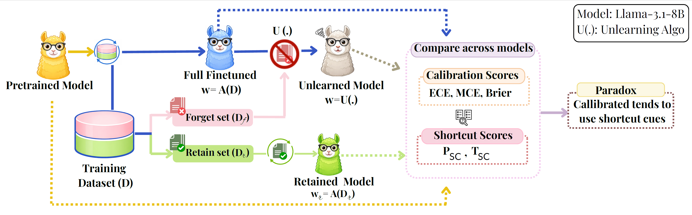
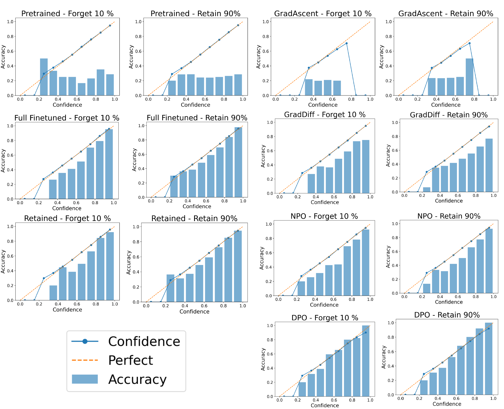
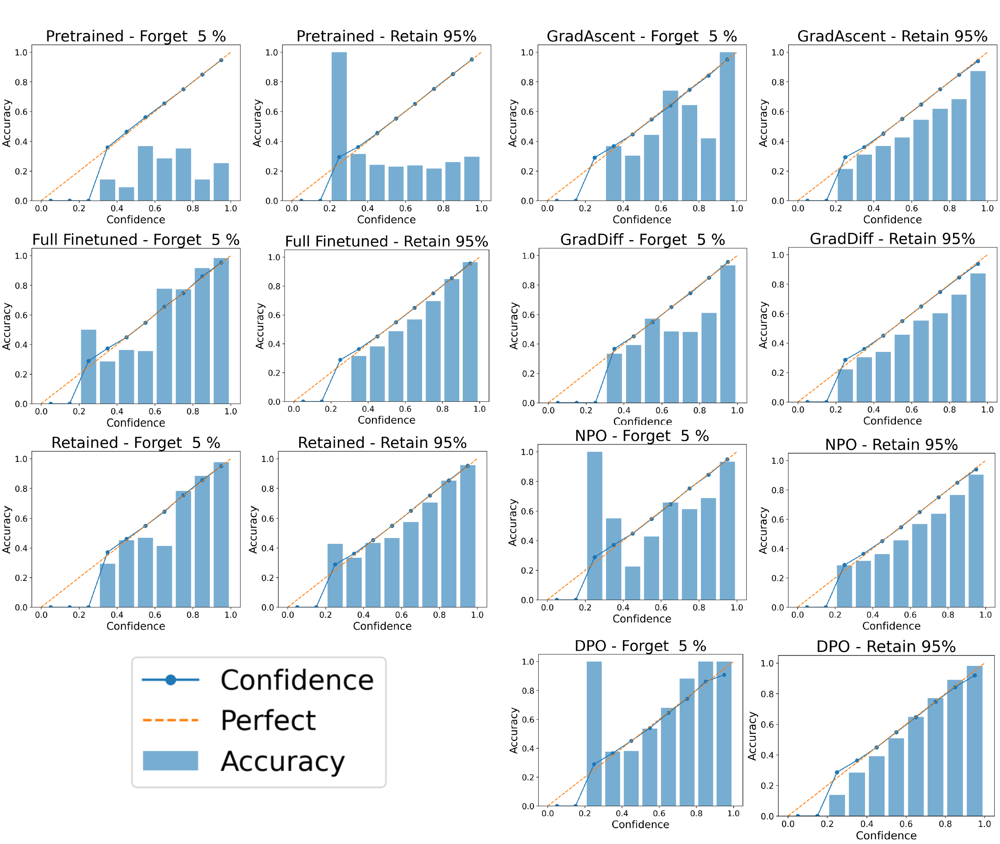
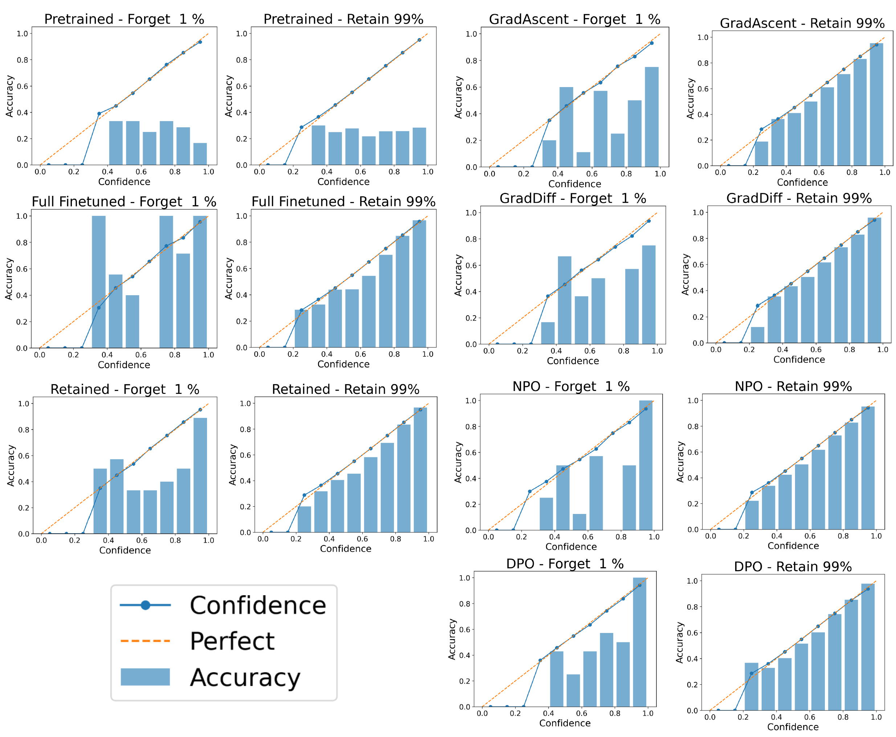

Calibration vs Decision Making: Revisiting the Reliability Paradox in Unlearned Language Models
===



## Abstract
Machine unlearning aims to remove the influence of specific training data from a model while preserving reliable behavior on the remaining data, making reliable prediction and uncertainty estimation essential for evaluation. Calibration is commonly used as a proxy for reliability in language models, but low calibration error does not necessarily imply reliable decision rules, as models may rely on spurious correlations while remaining well calibrated. We investigate this gap in generative language models using the multiple-choice question-answering evaluation protocol on the TOFU benchmark, measuring probabilistic reliability with calibration metrics (ECE, MCE, Brier) and decision-rule reliability via attribution-based shortcut detection with Integrated Gradients and Local Mutual Information. We find that fine-tuned models achieve low calibration error (ECE ≈ 0.04) compared to pretrained models (ECE > 0.5), and models after unlearning retain similarly low calibration despite reduced accuracy on the forget split, while attribution analysis shows increased reliance on correlation-based tokens. These results demonstrate that good calibration can coexist with shortcut-based decision rules after unlearning, extending the reliability paradox to the machine unlearning setting.

## Implementation details

This repository is an extension of [Open-Unlearning](https://github.com/locuslab/open-unlearning). We use the finetuned and retained versions of Llama-3.1-8B provided by Open-Unlearning, which are available at [Hugging Face](https://huggingface.co/locuslab). The evaluation code for calibration and attribution analysis is implemented in `evaluation.py`. We then added the MCQA evaluation from RELU (Joshi et al., 2024) to the main pipeline and added another script `scripts/relu_evaluate.sh` to run the evaluation.

Install the dependencies using the `requirements.txt` file:
```bash
pip install -r requirements.txt
```
These dependencies are **valid till March 2026**, and may need to be updated in the future.

This script will evaluate the pretrained, retained, and finetuned versions of Llama-3.1-8B on the RELU benchmark, recording the predicted output and the confidence score for each question. This is saved into `saves/eval`. 
```bash
bash scripts/relu_evaluate.sh
```

The unlearned models are trained on the TOFU benchmark and then evaluated on the RELU benchmark using the below bash script. The script will run the appropriate unlearning algorithm on the finetuned model and then evaluate it on each epoch of unlearning, saving the results in `saves/unlearn`.
```bash
bash scripts/tofu_unlearn.sh
```

The `calibration-plots.py` script can then be used to generate the calibration plots for the pretrained, finetuned, and unlearned models. The script will read the saved evaluation results from `saves/eval` and `saves/unlearn` and generate the calibration plots in `saves/eval/plots`.
```bash 
python calibration-plots.py
```


### Reliability Diagrams
#### Forget 10% of the data

#### Forget 5% of the data

#### Forget 1% of the data


### Citing previous work
```bibtex
@article{openunlearning2025,
  title={{OpenUnlearning}: Accelerating {LLM} Unlearning via Unified Benchmarking of Methods and Metrics},
  author={Dorna, Vineeth and Mekala, Anmol and Zhao, Wenlong and McCallum, Andrew and Lipton, Zachary C and Kolter, J Zico and Maini, Pratyush},
  journal={arXiv preprint arXiv:2506.12618},
  year={2025},
  url={https://arxiv.org/abs/2506.12618}
}
@inproceedings{maini2024tofu,
  title={{TOFU}: A Task of Fictitious Unlearning for {LLMs}},
  author={Maini, Pratyush and Feng, Zhili and Schwarzschild, Avi and Lipton, Zachary Chase and Kolter, J Zico},
  booktitle={First Conference on Language Modeling},
  year={2024}
}
```